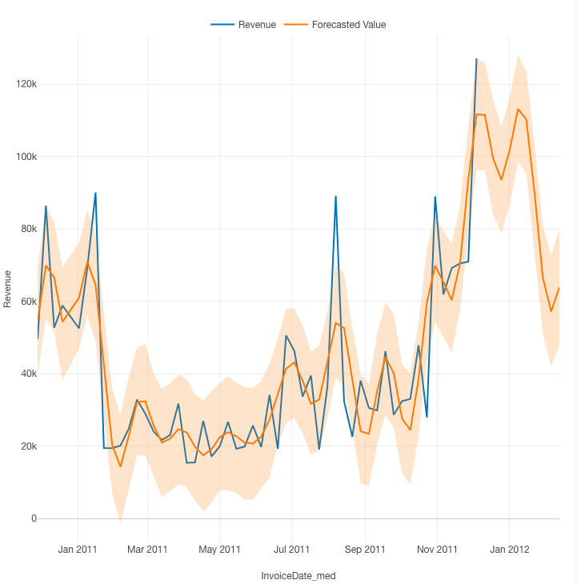
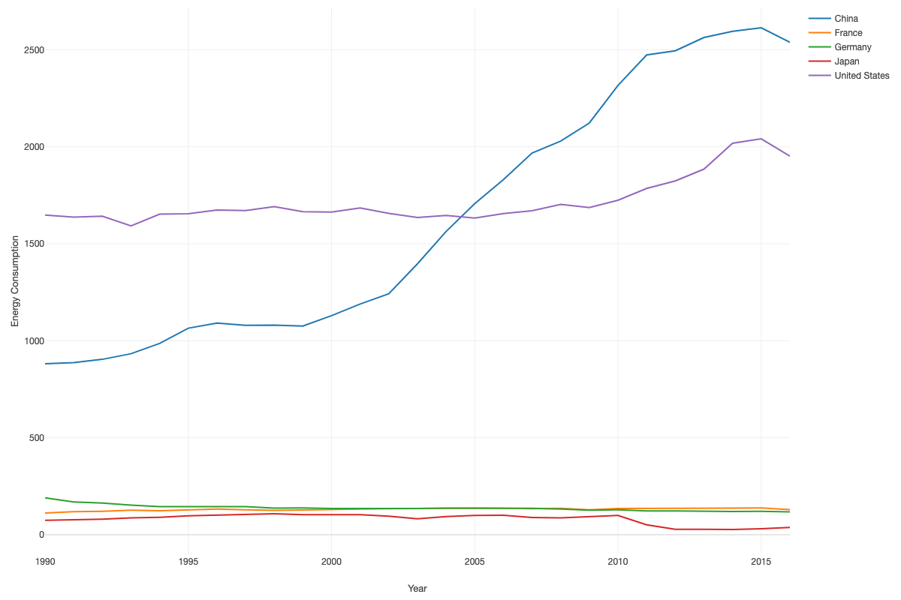
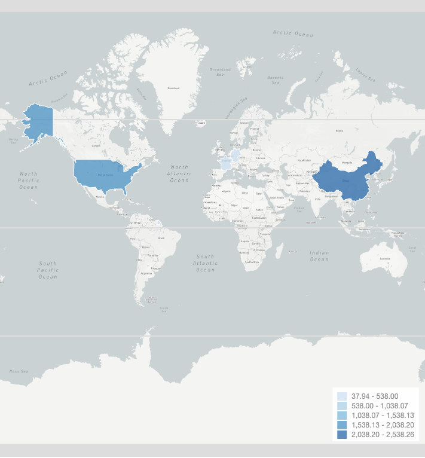
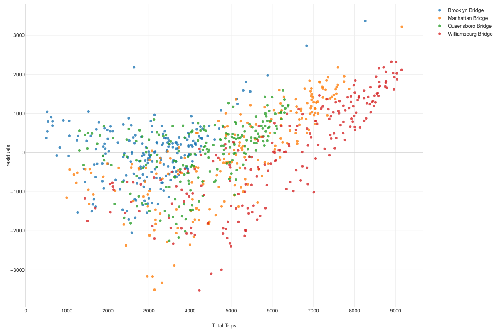
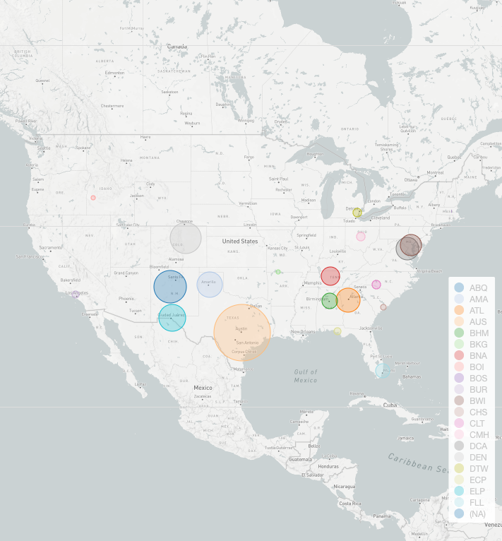
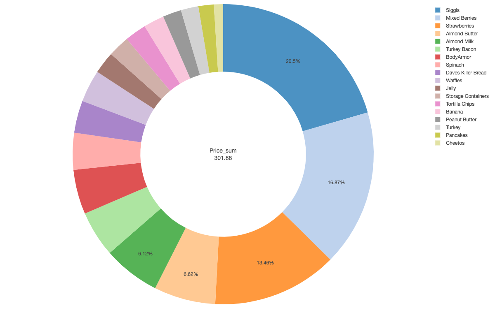

|Forecasted Revenue|
|---------------------------------------|
|

|
|This graph displays projected revenue for a company based on the previous years sales.  It takes into account seasonality to create 10 weeks of revenue projections.|

|Energy Consumption by Country 1990-2016|
|---------------------------------------|
|
 
|
|This graph shows the annual energy consumption refined by the Countries with the top five economies.  This shows the stagnant growth from Germany, Japan, and France.  The U.S. has seen a slight uptick in energy usage from 1990 while China’s industrializing economy has seen a large scale growth matched with the growth of its economy.|

|Energy Consumption by Country in 2016|
|---------------------------------------|
|
 
|
|This graph shows the 2016 energy consumption of the countries with the top 5 economies.  China and the U.S. are much greater than the rest with China consuming the most energy. |

|Predicted New York City Bridge Traffic|
|---------------------------------------|
|
 
|
|This graph shows the predicted traffic per bridge using a GLM.  This model takes into account day of week, weather, and other factors.  This shows that the Williamsburg takes the highest volume followed by the Manhattan Bridge.|

|Houston Airport Inbound Traffic|
|-|
|
 
|
|This graph displays the volume of flights from the original airport heading inbound to the Houston Airport.  This displays that the Austin airport sends the largest amount of planes to Houston.  It also shows a large influx from cities such as Albuquerque, Santa Fe, Denver, and Atlanta.|

|Grocery Spending Distributions|
|---------------------------------------|
|
 
|
|This graph shows the percent distributions of spending habits at Kroger.  This data was useful for budgeting to show the areas and products in which the largest amount of money was going.  It allowed me to where I could look to save money and quit overspending.|
